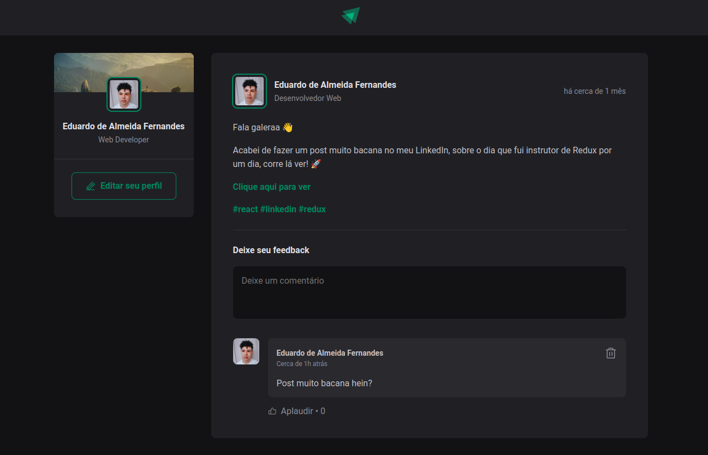

# Projeto Ignite-Feed

O Ignite Feed é uma aplicação desenvolvida em ReactJS que simula a tela de posts de um blog, onde a pessoa pode interagir com os posts já existentes comentando e curtindo. Desenvolvi essa aplicação dentro do curso Ignite da Rocketseat.

## Indice
- <a href="#funcionalidades">Funcionalidades do Projeto</a>
- <a href="#layout">Layout</a>
- <a href="#demonstracao">Demonstração</a>
- <a href="#rodar">Como rodar o projeto?</a>
- <a href="#tecnologias">Tecnologias Utilizadas</a>
- <a href="#passos">Próximos Passos</a>

<a id="funcionalidades"></a>
## :iphone: Funcionalidades do Projeto

- [x] Adicionar um comentário
- [x] Remover um comentário
- [x] Dar like

<a id="layout"></a>
## :computer: Layout
Versão desktop:


Versão Mobile:<br>


<a id="demonstracao"></a>
## :bulb: Demonstração
[Acesse aqui](https://ignite-feed-bice-nine.vercel.app/)

<a id="rodar"></a>
## :mag_right: Como rodar o projeto?
### 1 - Clone o repositório
```bash
$ git clone https://github.com/edu-almeidaf/Ignite-Feed.git
```
### 2 - Acesse a pasta do projeto no seu terminal
```bash
$ cd Ignite-Feed
```
### 3 - Instale as dependências
```bash
$ npm install
```
### 4 - Execute a aplicação
```bash
$ npm run dev
```
### 5 - A aplicação será iniciada na porta 5173, acesse pelo navegador:
```bash
http://localhost:5173/
```
<a id="tecnologias"></a>
## :wrench: Tecnologias Utilizadas
1. [React](https://react.dev/)
2. [Typescript](https://www.typescriptlang.org/)
3. [CSS Modules](https://github.com/css-modules/css-modules)
4. [Phosphor Icons](https://github.com/phosphor-icons/react)
5. [Date Fns](https://date-fns.org/docs/Getting-Started)

<a id="passos"></a>
## :hammer: Próximos passos
- [ ] Implementar da funcionalidade do usuário criar post
- [ ] Implementar a tela de edição de perfil
- [ ] Implementar a função de deslogar da página e logar com Github